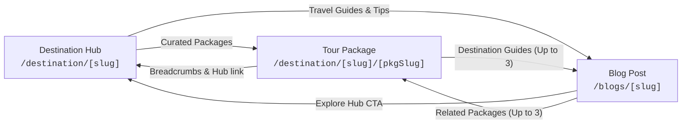

# Hassle Free Travels — Destination-Agnostic Content Engine (Blogs & Packages)

This document specifies the content management architecture for **Hassle Free Travels**, covering both the **Blog Engine** and the **Package Engine**.

---

## 1. The Core Formulas

$$\text{1 Blog Template } (\texttt{/blogs/[slug]}) + \infty \text{ Posts in Postgres} = \infty \text{ Unique Blog URLs}$$

$$\text{1 Package Template } (\texttt{/destination/[id]/[packageSlug]}) + \infty \text{ Packages in Postgres} = \infty \text{ Unique Tour Pages}$$

### Guiding Principles
1. **Zero Hardcoded Runtime Content**: Neither blog posts nor tour itineraries are hardcoded in static files like `src/data/blogs.ts` or `src/data/packages.ts`.
2. **Single Flexible Templates**: There is NO page per blog, NO page per destination, and NO Spiti-only template. One template renders any destination or post with high visual density and conversion focus.
3. **Database as Source of Truth**: Managed in Neon PostgreSQL via Drizzle ORM.
4. **Instant Publishing (Zero Code)**: Create and publish directly from the Admin CMS (`/admin`). Pages go live immediately with on-demand cache revalidation and dynamic sitemap inclusion.

---

## 2. Public URL Patterns & Routing Rules

| Content Type | URL Pattern | Database Source | Canonical Rule |
| :--- | :--- | :--- | :--- |
| **All Blogs Listing** | `/blogs` | `blog_posts` (`is_published = true`) | `https://www.hasslefree-travels.com/blogs` |
| **Single Blog Post** | `/blogs/[slug]` | `blog_posts` row by `slug` | `https://www.hasslefree-travels.com/blogs/[slug]` |
| **Destination Hub** | `/destination/[slug]` | `destinations` table + published packages + published blog guides | `https://www.hasslefree-travels.com/destination/[slug]` |
| **Tour Package** | `/destination/[slug]/[packageSlug]` | `packages` linked to destination | `https://www.hasslefree-travels.com/destination/[slug]/[packageSlug]` |
| **Tour Redirect** | `/tours/[slug]` | `packages` table lookup | 301 Permanent Redirect to `/destination/[slug]/[packageSlug]` |

> [!NOTE]
> Blog URLs are intentionally NOT nested under `/destination/.../blog/...` to consolidate domain authority into a clean, flat `/blogs/[slug]` hierarchy.

---

## 3. Bidirectional Cross-Linking Architecture

Every piece of content is interconnected to maximize internal link equity and user conversion:



1. **FROM Blog Post (`/blogs/[slug]`) TO:**
   - **Destination Hub**: If `destination_id` is set, a dedicated destination CTA banner links directly to `/destination/[slug]`.
   - **Related Packages**: Displays up to 3 published tour packages belonging to the post's destination.
   - **Related Posts**: Displays 3 other published articles matching the category or destination.
   - **WhatsApp & Enquiry CTA**: Pre-filled with the destination name and post title.

2. **FROM Destination Hub (`/destination/[slug]`) TO:**
   - **Published Packages**: Dynamic package cards with starting price, duration, and direct links to `/destination/[slug]/[packageSlug]`.
   - **Travel Guides & Tips**: All published blog posts where `destination_id` matches the hub.

3. **FROM Package Template (`/destination/[slug]/[packageSlug]`) TO:**
   - **Destination Hub**: Breadcrumbs (`Home → Destination → Package`) and destination tags.
   - **Related Destination Guides**: Up to 3 published blog posts tagged with that package or destination.
   - **Related Packages**: Up to 3 companion itineraries for the same destination.

---

## 4. How to Add Content (Admin CMS)

Access the secure CMS at `https://www.hasslefree-travels.com/admin` (or `http://localhost:3000/admin` in development) using your admin credentials.

### A. How to Publish a New Blog Post (Zero Code)
1. Go to **Admin → Blogs → Create New Post** (`/admin/blogs/new`).
2. Fill out the form:
   - **Article Title (H1)**: e.g., *Top 10 Hidden Waterfalls in Wayanad for 2026*.
   - **Slug**: Auto-generated from title or custom (e.g., `hidden-waterfalls-in-wayanad-2026`).
   - **Associated Destination**: Select from the dropdown (e.g., *Wayanad*). Links the post to the Wayanad hub and enables related packages.
   - **Featured Package**: Optionally link a specific tour package.
   - **Category**: e.g., *Travel Guide*, *Offbeat Adventures*, *Best Time to Visit*.
   - **Excerpt**: 2-3 engaging summary sentences for listing cards and SEO.
   - **Markdown Body**: Write in standard Markdown (headings, lists, bold/italic, quotes, links). Use the **Live Preview** tab for WYSIWYG feedback.
   - **Featured & OG Image**: High-resolution image URL.
   - **SEO Metadata**: Unique SEO Title (50-60 chars) and Meta Description (140-160 chars).
   - **Blog FAQs**: Add Q&A items to generate Google-rich snippet `FAQPage` schema.
3. Check **Publish Live to Site** and click **Save & Publish 🚀**.
4. **Immediate Outcome:**
   - Post is live at `/blogs/[slug]`.
   - Appears at the top of `/blogs` listing.
   - Displays in the "Travel Guides" section of the Wayanad hub (`/destination/wayanad`).
   - Included in `/sitemap.xml` with fresh `lastModified`.
   - ISR caches revalidated on demand.

### B. How to Add a Goa / Thailand / Japan Itinerary (Zero Code)
1. Go to **Admin → Packages → Create New Package** (`/admin/packages/new`).
2. Fill out the tour details:
   - **Destination**: Select *Goa* (or any destination).
   - **Package Name**: e.g., *Goa Beach & Heritage Explorer 4N/5D*.
   - **Slug**: e.g., `goa-beach-heritage-explorer-4n5d`.
   - **Duration & Pricing**: Days, nights, starting price (₹ INR), and price note.
   - **Logistics**: Meals, accommodation tiers, transport, and inclusions/exclusions.
   - **Day-by-Day Itinerary**: Add titles, descriptions, meals, and stays for each day.
   - **Tour FAQs**: Common questions for traveler confidence and FAQ schema.
   - **SEO Metadata**: Unique title, description, and hero banner.
3. Click **Publish Live 🚀**.
4. **Immediate Outcome:**
   - Tour is live at `/destination/goa/goa-beach-heritage-explorer-4n5d`.
   - Automatically listed on the Goa destination hub (`/destination/goa`).
   - Sitemaps and cache revalidated.
   - Lead forms route bookings to the database and email/Telegram notifications.

---

## 5. Database Schema Reference

### `blog_posts` Table
```sql
CREATE TABLE blog_posts (
  id uuid PRIMARY KEY DEFAULT gen_random_uuid(),
  slug text UNIQUE NOT NULL,
  title text NOT NULL,
  excerpt text NOT NULL,
  content_md text NOT NULL,
  category text,
  tags text[],
  author_name text DEFAULT 'Hassle Free Travels' NOT NULL,
  featured_image text,
  og_image text,
  seo_title text NOT NULL,
  seo_description text NOT NULL,
  destination_id uuid REFERENCES destinations(id) ON DELETE SET NULL,
  package_id uuid REFERENCES packages(id) ON DELETE SET NULL,
  destination_slug text,
  read_minutes integer DEFAULT 5 NOT NULL,
  is_published boolean DEFAULT false NOT NULL,
  published_at timestamp with time zone,
  created_at timestamp with time zone DEFAULT now() NOT NULL,
  updated_at timestamp with time zone DEFAULT now() NOT NULL
);
```

### `blog_faqs` Table
```sql
CREATE TABLE blog_faqs (
  id uuid PRIMARY KEY DEFAULT gen_random_uuid(),
  post_id uuid NOT NULL REFERENCES blog_posts(id) ON DELETE CASCADE,
  question text NOT NULL,
  answer text NOT NULL,
  sort_order integer DEFAULT 0 NOT NULL
);
```

---

## 6. Verification & Build Commands

```bash
# Verify database connection and seed data
npm run db:seed

# Check TypeScript and ESLint compliance
npm run lint

# Build production bundle with all static routes pre-rendered
npm run build
```
